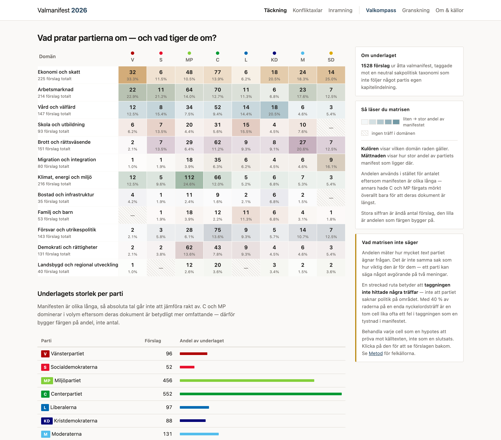
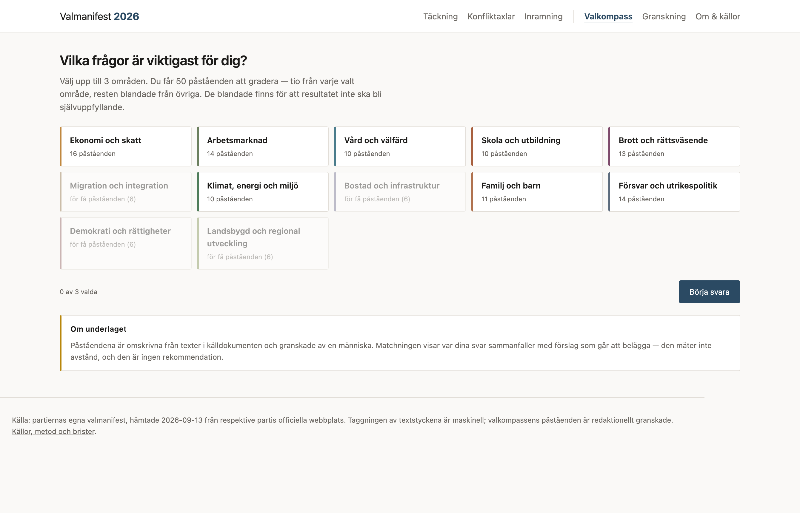

# Valmanifest 2026

[]()
[]()

**Ett arbetsexempel på hur en ostrukturerad textmassa blir ett beslutsunderlag
som går att ifrågasätta.**

108 206 ord valmanifest → en kategoriserad datamängd → ett verktyg som visar
sin egen osäkerhet. Allt öppet: källdokument med checksummor, kategorierna,
koden, och en changelog som innehåller felen lika utförligt som framstegen.

Valmanifesten är testmaterialet, inte poängen. Samma metod fungerar på
kundintervjuer, remissvar, offerter eller mötesprotokoll.

**Publicerat 2026-09-13:**
[artikeln på LinkedIn](https://www.linkedin.com/pulse/d%C3%A4rf%C3%B6r-kan-du-inte-bara-en-ai-sammanfatta-era-dokument-tomas-andr%C3%A9-18ipf/) ·
[inlägget](https://www.linkedin.com/feed/update/urn:li:activity:7504920473386909696/)



*Varje ruta går att klicka på och spåra tillbaka till en textrad i ett
källdokument. Panelen till höger talar om vad måttet inte säger — 40 % av
raderna vilar på en enda ordträff, och en streckad ruta betyder att
sorteringen inte hittade något, inte att dokumentet är tyst.*

## Börja här

| Om du vill… | Gå till |
|---|---|
| **Förstå metoden** | [`ARTIKEL.md`](ARTIKEL.md) — sex steg, felen kvar |
| **Prova verktyget** | Kör appen (nedan) → [valkompassen](#valkompassen) på `/kompass` |
| **Se resultatet** | Täckningsmatrisen på `/`, eller metodsidan `/om` |
| **Granska datan** | [`domains/pastaenden.jsonl`](domains/pastaenden.jsonl) |
| **Kontrollera källorna** | [`domains/kallor.yaml`](domains/kallor.yaml) — URL + SHA256 |
| **Se vad som gick fel** | [`CHANGELOG.md`](CHANGELOG.md) |

```bash
git clone https://github.com/tandregbg/valet2026.git && cd valet2026
python3 -m venv .venv && .venv/bin/pip install flask pyyaml pytest
.venv/bin/python app/app.py     # adressen skrivs ut
```

---

## Poängen: flödet är omvänt

Det vanliga sättet är att klistra in texten i en chatt och be om en analys.
108 206 ord får plats i ett modernt kontextfönster, så det *går*.

Problemet är inte kapaciteten — det är att modellen då fattar hundratals små
tolkningsbeslut som ingen ser: vad som räknas som ett förslag, vilken kategori
det hör till, vad som är jämförbart med vad. Besluten är inte nedskrivna, går
inte att granska, och kan ändras mellan två körningar.

Här görs det tvärtom:

```
1. Läs in källdata          ->  verifierad, med checksummor
2. Läs och förstå strukturen ->  MÄNNISKA
3. Konstruera en taxonomi    ->  MÄNNISKA, i en fil man kan invända mot
4. Segmentera och tagga      ->  KOD, deterministiskt
5. Granska och skriv om      ->  MÄNNISKA, varje rad
6. Visualisera strukturen    ->  KOD
```

Analysen görs **på strukturen**, inte på texten. Kategorierna är definierade
innan analysen börjar, i en fil som går att läsa, versionshantera och
argumentera emot.

---

## Vad som är vad

| Lager | Innehåll |
|---|---|
| **Rent innehåll** | Utgivarnas egen text, ordagrant. Inget genererat. |
| **AI-assisterad kod** | Verktyget. Skrivet med AI-assistans, deterministiskt när det körs. |
| **Språkmodell** | Utvecklingsassistent och utkastgenerator. **Ingen roll i databearbetningen.** |
| **Mänskligt omdöme** | Taxonomin, granskningen, och besluten om vad som inte ska redovisas. |

Taggningen av 1 528 textstycken görs med nyckelordsmatchning, inte med en
språkmodell. Sämre träffsäkerhet — men determinism, granskbarhet och ärlighet
om osäkerhet väger tyngre. Se `ARTIKEL.md` för varför det visade sig avgörande.

---

## Struktur

```
val2026/                  # katalognamn lokalt; repot heter valet2026
├── manifest/          Källdokument (PDF + text) + INDEX.md med checksummor
├── domains/
│   ├── taxonomi.yaml      12 domäner, 60 subdomäner, 5 konfliktaxlar
│   ├── kallor.yaml        Källförteckning med URL och SHA256
│   ├── extrahera.py       Segmentering + taggning
│   ├── forslag.jsonl      1 528 taggade textstycken
│   ├── kandidater.py      Kandidatgenerering till valkompassen
│   ├── kandidater.jsonl   291 kandidater
│   └── pastaenden.jsonl   122 granskade påståenden
├── app/               Flask-app
├── docs/change-requests/  CR-001..005
├── tests/             35 tester
├── ARTIKEL.md         Teknisk genomgång av processen
└── CHANGELOG.md
```

## Köra

```bash
python3 -m venv .venv && .venv/bin/pip install flask pyyaml pytest
.venv/bin/python domains/extrahera.py     # bygg om forslag.jsonl
.venv/bin/python -m pytest tests/ -q      # 35 tester
.venv/bin/python app/app.py               # startar servern
```

Appen binder till `0.0.0.0` och skriver ut både den lokala adressen och
nätverksadressen vid start, så den går att testa från telefon eller annan
dator på samma nät.

| Miljövariabel | Default | Effekt |
|---|---|---|
| `VAL2026_HOST` | `0.0.0.0` | Sätt till `127.0.0.1` för att bara lyssna lokalt |
| `VAL2026_PORT` | `5001` | Port |
| `VAL2026_SECRET` | slumpas | Sessionsnyckel; sätt för att behålla sessioner över omstart |

**Appen har ingen inloggning.** Alla på nätverket kan nå den, inklusive
`/granskning` som skriver till datafilerna. Kör bara på nät du litar på, och
använd en riktig WSGI-server om den någonsin ska exponeras bredare.

## Vyer

| Vy | Fråga |
|---|---|
| `/` | Hur fördelar sig varje källas innehåll över domänerna? |
| `/doman/<id>` | Vad står det faktiskt inom ett sakområde? |
| `/axlar` | Vilka mönster skär tvärs över domängränserna? |
| `/inramning` | Hur förhåller sig källans egen rubrik till sakfrågan? |
| `/kompass` | Valkompass: gradera 50 påståenden, se överensstämmelse |
| `/granskning` | Redaktionell granskning av kandidater |
| `/om` | Källor, process, arbetsdelning och brister |

---

## Valkompassen

Verktyget innehåller en valkompass, och den är byggd för att visa skillnaden
mellan ett svar och ett underlag.



Du väljer upp till tre sakområden, graderar 50 påståenden på en femgradig
skala, och får se vilka dokument som ligger närmast dina svar. Så långt som
vilken valkompass som helst.

Skillnaden ligger i vad som händer sedan — och i vad den vägrar göra.

**Varje påstående är spårbart.** De 122 påståendena är inte formulerade av
mig på fri hand. De är omskrivna från faktiska textstycken i källdokumenten
och granskade en i taget. Originaltexten följer med hela vägen till
resultatvyn, så du kan kontrollera att omskrivningen var rimlig.

**Frånvaro tolkas aldrig som motstånd.** Om ett dokument inte innehåller
något om ett påstående kan det betyda tre saker: utgivaren är emot, de
prioriterar annat, eller extraktionen missade det. Algoritmen kan inte skilja
dem åt — så den räknar inte frånvaro som ett nej. Det finns ett enhetstest
som verifierar just det.

**Procent visas aldrig utan täckning.** En källa med 90 % på 8 belägg är
inte en bättre matchning än 72 % på 31. Båda talen står alltid tillsammans.

**Fyra områden går inte att välja.** Migration, bostad, demokrati och
landsbygd har under tio granskade påståenden, och kandidatunderlaget är
uttömt. De visas gråmarkerade med antalet utskrivet i stället för att fyllas
ut med svagt material.

Det sista är kanske det tydligaste exemplet på hållningen i hela projektet:
**det är bättre att ett verktyg säger "det här kan jag inte" än att det
gissar snyggt.**

Kör den lokalt via `/kompass`. Granskningsgränssnittet ligger på
`/granskning` om du vill se hur påståendena blev till: **291 kandidater blev
122 godkända.** De 169 som förkastades var trasig PDF-text, metatext om
dokumentet självt, rubriker utan graderbart sakinnehåll, dubbletter och
feltaggningar.

Att över hälften föll bort är inte ett misslyckande — det är vad granskningen
är till för.

---

## Spårbarhet

Varje påstående i valkompassen går att följa tillbaka till en namngiven fil
med checksumma. Kedjan är verifierad — noll brutna länkar.

```
Påstående → källhänvisning → originaltext → taggat stycke
          → utgivarens egen rubrik → källdokument (SHA256)
```

---

## Brister — läs dessa

- **40 % av de taggade textstyckena** vilar på en enda nyckelordsträff.
- **Fyra av tolv domäner** har för få granskade påståenden och är inte
  valbara i valkompassen. Kandidatunderlaget är uttömt — det är en verklig
  gräns i materialet.
- **En källa fick bidra med ett extra dokument** (Miljöpartiets
  handlingsprogram), vilket påverkar alla jämförelser den ingår i. Beslutet
  redovisas öppet i `domains/kallor.yaml`.
- **Antal enheter speglar dokumentets längd** och parserns granularitet minst
  lika mycket som utgivarens prioriteringar.
- **Matchningen mäter överensstämmelse där det finns belägg, aldrig avstånd.**
  Att ett förslag saknas betyder inte motstånd.

Ett konkret exempel på varför granskning behövs: nyckelordet `isk`
(investeringssparkonto) matchade som delsträng i *svensk*, *fisket* och
*människors*. 214 av 221 träffar i en subdomän var brus. Maskinen upptäckte
det inte — pipelinen körde grönt. En människa som tyckte att en färg såg
konstig ut gjorde det.

## Vad projektet inte gör

Verktyget utvärderar ingen politik, rangordnar inte partier och rekommenderar
inget. Det gör åtta dokument läsbara sida vid sida enligt en struktur som är
öppen att granska. Läsningen, och besluten, är läsarens.

---

## Källor

Samtliga dokument hämtade 2026-09-13 från respektive utgivares officiella
webbplats. Fullständiga URL:er och SHA256 i `domains/kallor.yaml` och
`manifest/INDEX.md`.

## Licens

Koden är fri att använda. **Källdokumenten tillhör respektive utgivare** och
ingår här som citat för analysändamål.
